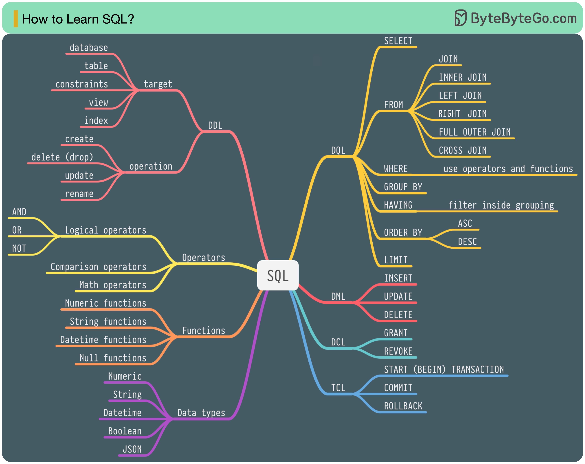

# Learning Database
This is a collection of SQL files and resources to use as a refresher for TSQL.
1. Data has some database files that can be used for practice.
2. Essential has the necessary basic TSQL examples from the course "Microsoft SQL Server 2019 Essential Training" by Adam Wilbert from LinkedIn Learning.
3. Proram_Databases contains examples from "Program Databases with Transact-SQL" by Adam Wilbert from LinkedIn Learning.

## Resources:
1. https://blog.bytebytego.com/
2. Elmasri, R., & Navathe, S. B. (2011). Fundamentals of database systems, Addison-Wesley
3. LinkedIn Learning

## Components:
The following picture and the block of lines are directly quoted from [ByteByteGoHq Repository](https://github.com/ByteByteGoHq/system-design-101)

There are 5 components of the SQL language:
1. DDL: data definition language, such as CREATE, ALTER, DROP
2. DQL: data query language, such as SELECT
3. DML: data manipulation language, such as INSERT, UPDATE, DELETE
4. DCL: data control language, such as GRANT, REVOKE
5. TCL: transaction control language, such as COMMIT, ROLLBACK
For a backend engineer, you may need to know most of it. As a data analyst, you may need to have a good understanding of DQL. Select the topics that are most relevant to you.

Follow the above figure to categorize and visualize the learned stuff related to the database.
